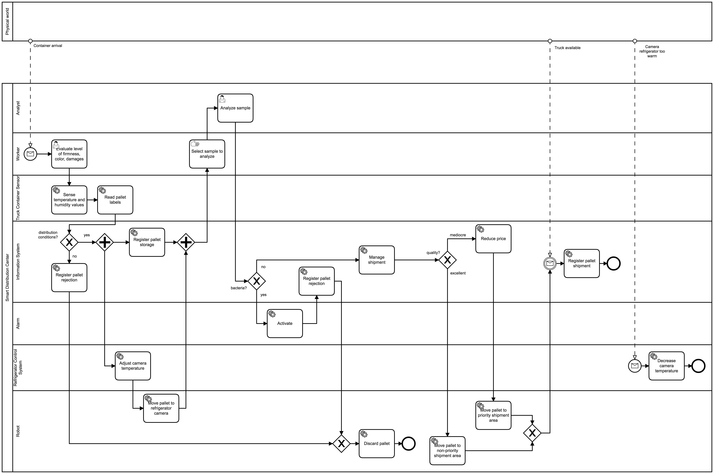
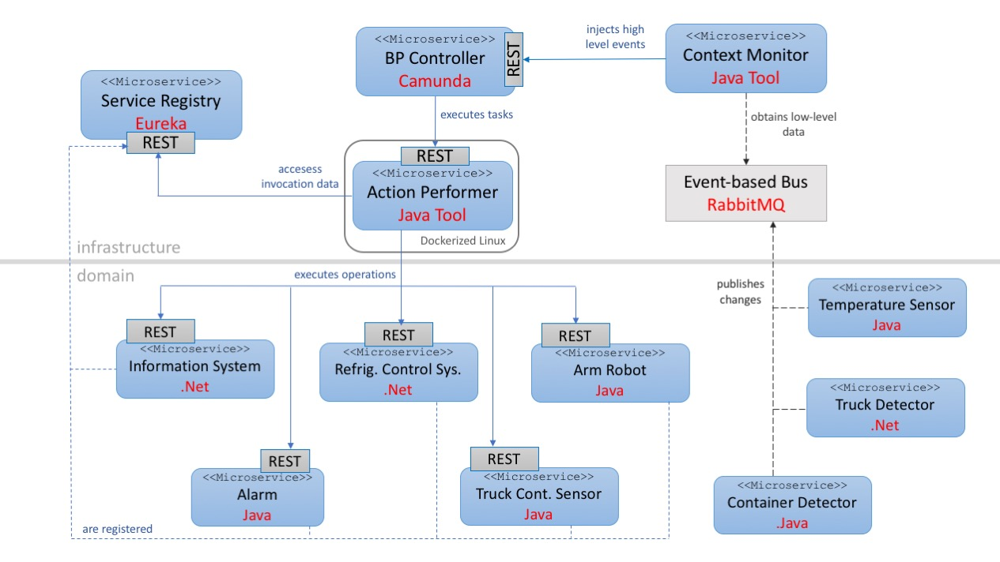

# IoT Enhanced Business Processes supported by BPMN and Microservices. Example

This example shows how to define an IoT Enhanced Business Processes by using BPMN diagrams and how to deploy into a microserive infrastructure. 
To do so, the supporting infrastructure available in the following Github repository is used: [iot-enhanced-business-process-infrastructure](https://github.com/pvalderas/iot-enhanced-business-process-infrastructure).

# About

This is the result of a reserach work leaded by Pedro Valderas at the PROS Research Center, Universitat Politècnica de València, Spain.

This work presents a modelling approach based on BPMN that reuses the concepts introduced by this language in order to model IoT-enhanced BPs. This modelling approach allows specifying IoT devices and both push and pull interactions between the process and Iot Devices, without modifying the BPMN metamodel.

This modelling approach is suppoted by a microservice architecture aimed at facilitating the integration of business processes with the physical world that provides high flexibility to support multiples IoT device technologies, and facilitates evolution and maintenance.

# The modelling approach. Main guidelines

The main guidelines of the proposed modelling approach are the following:

1. A BPMN pool is used to represent the whole IoT-enhance business process within an organization.
2. Each IoT device or any other actor of an organization that participate in the process is represented by a lane of this pool.
3. Each IoT device action is defined as a Service Task.
4. The execution of the Service Tasks that represents actions of IoT devices support pull interactions.
5. The physical world is represented by a collapsed pool.
6. Push interactions are represented by flow sequences whose source is the collapsed pool that represent the physical world and whose target is a message start event or a message intermediate catch event defined in a lane.

# Example overview

The BPMN IoT-Enhanced business process supported by these microservices is the following:



The process starts when a container with a pallet of a same product arrives to the smart distribution centre.
The first thing to do at the distribution centre is to check the quality of the products of the pallet (level of firmness, colour, and possible damages). This is done by a worker who is in charge of registering the results in the system. Next, the conditions in which the products have been transported, i.e., the container’s temperature and humidity are automatically sensed. Based on this first evaluation, the products are considered in good quality or not for distribution. If not, the rejection of the pallet is registered and it is discarded by moving it to a garbage. On the contrary, if the quality of the products is good for consumption, the pallet is registered in the distribution centre and placed into a transportation line to be stored in a refrigerated camera climatized accordingly to avoid product spoilage (e.g., oranges must be kept between 2 and 12 Celsius degrees and at 90% relative humidity). 
Besides this first product control, a second one is performed over a sample in the laboratory. This analysis will determine whether molds, yeast, and certain bacteria has grown in the received products. If so, an alarm is activated, and the pallet is discarded by transporting it to the garbage. If no bacteria are detected, the shipment task of the received products can start. If the quality of the products is not excellent (e.g., they are good for distribution but firmness or colour are not the optimum), the price of the products is reduced and the pallet is prioritized to avoid their spoilage. Finally, all shipped pallets are registered in the system once a truck for transporting them is available.

# Implementation

This implementation is composed by 12 microservices:

* 3 microservices that manage IoT devices through Java Technology: Alarm, Robot, and TruckContainerSensor. These microservices are endowed with the functionality provided by the IoTDevice module (see the infrastruture repository introduce above), which provide the funcionality to allow the BP Controller to manage IoT devices throw a REST API.
* 2 microservices that manage and IoT devices and the information system of the organization through .Net Technology: RegrigeratorControlSystem and InformationSystem. These microservices are .Net apps implemented from scratch and implements the funcionality to allow the BP Controller to manage IoT devices throw a REST API in an ad-hoc way.
* 3 microservices that manage sensors and publish context data in the Event Bus: ContainerDetector and TemperatureSensor, implemented in Java; and TruckDetector, implemented in .Net.
* 1 infrastucture microservices: an Eureka service registry
* 3 microservices for supporing the execution of IoT Enhanced Business Processes: the BP Controller, the Action Peformer and the Context Manager. See the infrastruture repository introduce above for additional informaión about these microservices.



# Building and executing the example

Clone this Github repository and build each microservice with Gradle. To execute the microservice composition this example assumes you have [RabbitMQ](https://www.rabbitmq.com/) installed and started.

Execute the microservices in the following order:
<ol>
<li>Eureka Server</li>
<li>IoT microservices and Information System microservice</li>
<li>BPController, Action Performer and Context Monitor</li>
</ol>

# Creating an IoT Enhanced Business Process

The BP Controller of this example publishes at http://localhost:8081 a BPMN editor to create IoT Enhanced Business Processes. An animated snapshot of the BPMN editor is show next.


This editor allows you to associate a microserive to a BPMN lane and the operations of this microservice to the service tasks of this lane. The microservices and their operations are obtained from Eureka.

To test the example you can create a IoT Enhanced Business Processes from scratch or use the example uploaded at the root of this reposittory. 


# Executing an IoT Enhanced Business Process

The IoT Enhanced Business Process of the example is started when the Context Monitor injects the high-level event Container Arrival. To do so, the proper low-level context data should be published in an event-based bus supported by RabbitMQ server. Thus, this example assumes you have [RabbitMQ](https://www.rabbitmq.com/) installed.

The low-level context data should be publishes in JSON format and is used by the Context Monitor to infer that a container is within the WareHouse. For example, considering that an Object Detector is installed to detect a container, this low-level data could be as follows:

```json
{
	"device":"ObjectDetector",
	"id": "containerReceptionDetector",
	"property": "Container Availability",
	"feature": "Container",
	"dataProps":[
			{
				"name":"status",
				"value" true
			},
			{
				"name":"timestamp",
				"value" "2020-10-12 10:54:42.997"
			}
	]
	
}
```

This context-data is pubished in by the business microservice ContainerDetector.